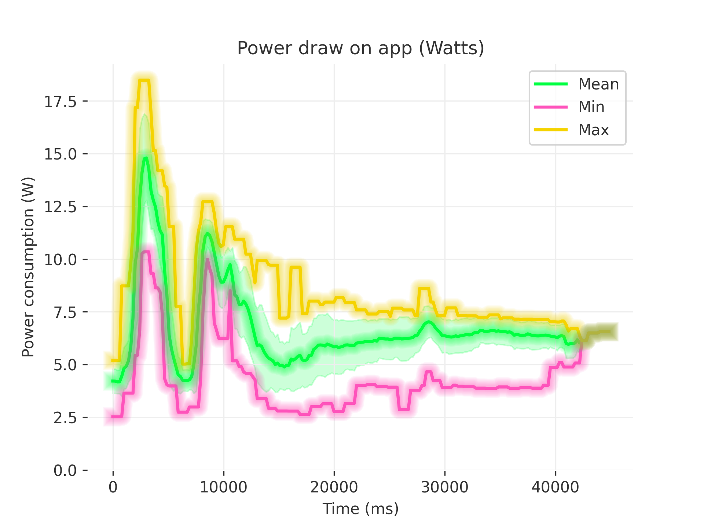
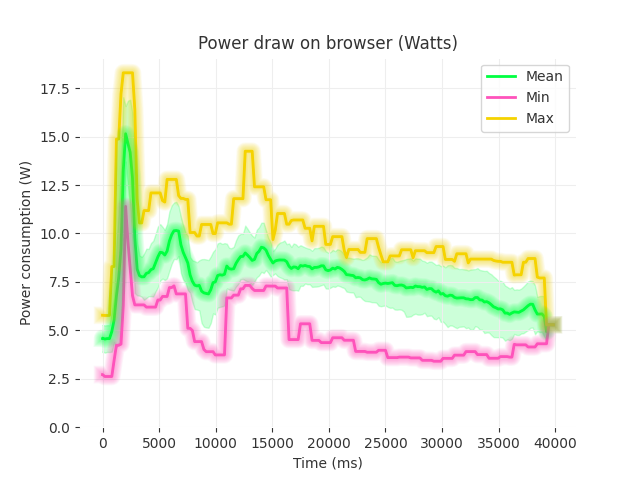
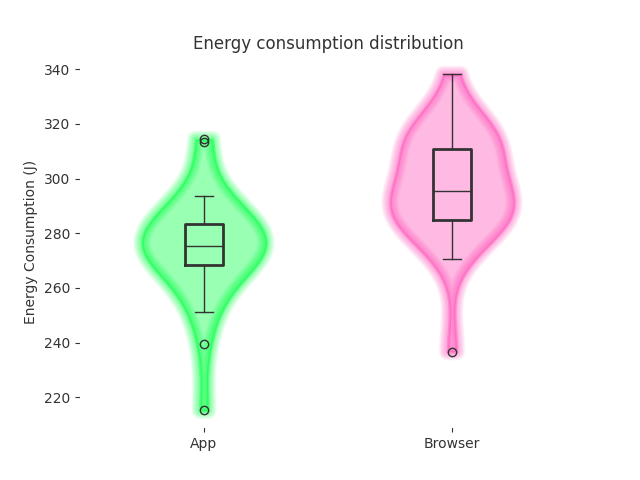

## Introduction
Energy efficiency is a growing concern all over the world, and as sofware and AI develops in giant steps, it is also a concern in the software development area. As applications become more resource-intensive, understanding the energy consumption of different software configurations is essentail. In this experiment, we compare the energy consumption of streaming a small piece of a movie using the Jellyfin web browser interface versus the Jellyfin native application. By measuring the energy consumption of these two approaches, we aim to identify which method is more energy-efficient and under which circumstances.
This study follows a systematic methodology to ensure unbiased and replicable energy measurements. The results of this experiment will help users and developers make informed decisions about optimizing software for energy efficiency.
## Methodology
### Experimental Setup
To minimize external interference and for easier replicability, we will try that the environment is as controlled as possible by doing the following:
 - Close all unnecessary applications.
 - Disable notifications and background services.
 - The experiment should have been done with a wired connection in order to obtain the best results, but this was not possible since at the time where the experiment was tested the only available connection was a 4G connection from the phone of one of the members of the group.
 - Set a fixed screen brightness and resolution and even turn off the display when the testing starts.
 - Ensure the device where the test is being done to be connected to a power source to avoid battery problems.

### Measurement Approach
We used pyEnergiBridge to measure the energy consumption of the Jellyfin web browser interface and the Jellyfin native application while playing the same movie (Fast & Furious). The measurement process involves the following:

 - Starting the energy measurement: Using EnergiBridgeRunner.start() before launching the playback.
 - Playing the movie for a fixed duration
 - Stopping the measurement: Using EnergiBridgeRunner.stop() after the playback ends.
 - Recording the energy consumption and execution time in a csv file.

## Results
### Power Draw on the App

Plot description:
 - X-axis (Time in microseconds).
 - Y-axis (Power in watts): the instantaneous system power consumption.
 - Lines:
    - Green (Mean): the average power across multiple measurements at each time slice.
    - Pink (Min): the lowest power measurement observed.
    - Yellow (Max): the highest power measurement observed.
 - General Shape: there is a pronounced spike in the first ~5s, followed by a downward trend, and eventually settling into a moderately stable range of 5 to 8 watts for the mean line.
 If we go more in more depth, we can divide the graphs in sections. We can observe that the initial spike to nearly 18W is common at the start of a video playback, as the application does video initialization, buffering, and possibly hardware-acceleration handshakes. The second section between ~5 to ~15 seconds, the mean drops from ~10W to ~6-8W. The difference between min and max indicates short bursts of higher CPU/GPU activity, we could see this section as the settling section. The third section ~15s onward, after the first peak, the power consumption drifts with less dramatic peaks. The mean line is around 6-7W, and the min line dips to around 2-3W at times, suggesting idle or partial idle states when frames are easily decoded, we could see this section as the stable section. 

 ### Power Draw on the Web Browser
 
 Plot description:
 - Similar Layout: same axes for time (ms) and power (W).
 - Lines: same as the previous plot.
 - General Shape: it also features a high spike initially, followed by a decline, with a somewhat amoother or narrower range than the App after the first few seconds.
 In this graph we can also divide it into different sections. The first section from 0 to ~5s, the peak reaches almost 18W again, consistent buffering or initialization. The second section from ~5-20s, the max line can reach 10-12W, while the min line dips around 3-4W. The mean line stabilizes at around 6-7W, this section could be seen as mid-range fluctuations. The last section from ~20-40+ seconds, there is a mild downward trend, though it stays fairly consistent around 5-7W for the mean, we considered this section as the later playback, since it indicates a general stable load. 
 Difference between the App and the Browser energy consumption: they both have similar behavior but the Browser may have fewer extreme downward dips than the App, this could indicate a steadier baseline overhead. On the other hand, it sometimes exhibits short bursts of activity that keep the max line slightly elevated.

 ### Energy Consumption Distribution (Violin + Box Plot)
 
 Plot description:
 - X-axis: Two categories, App (green) and Browser (pink).
 - Y-axis: Total energy consumption in Jules (J) over the entire test.
 - Violin Plots: Show the overall distribution (thick areas indicate more frequent values)
 - Box Plots: Show the median line, interquartile range, and possible outliers.

 The App distribution spans from roughly 220J to 340J in the extremes. The box (middle 50% of data) centers around 260-280J, with a median near to 270J. Outliers indicate some runs, where the total energy was lower or higher than the bulk measurement.

 The Browser distribution ranges similarly from ~220 to ~340J, but the distribution appears slightly shifted upward, meaning that the box is a bit higher. The median is around 280J, with the top of the box approximately around 300J. The outliers on both ends suggest variability in the measurement environment or usage pattern.

 Even though both the App and the Browser are quite similar, the Browser's median and upper quartile appear slightly higher, this suggests that the overall energy usage can be marginally greater for the Browser across these tests.

